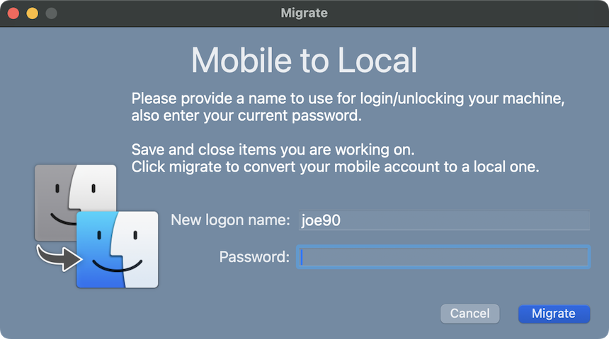
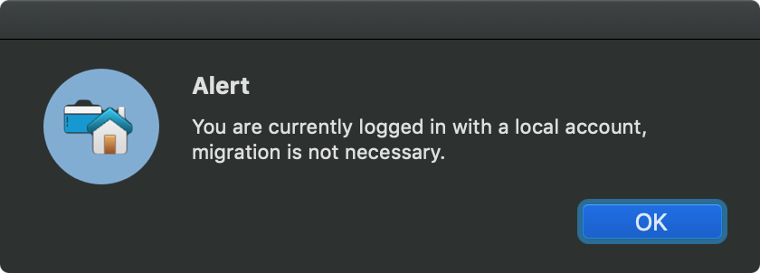
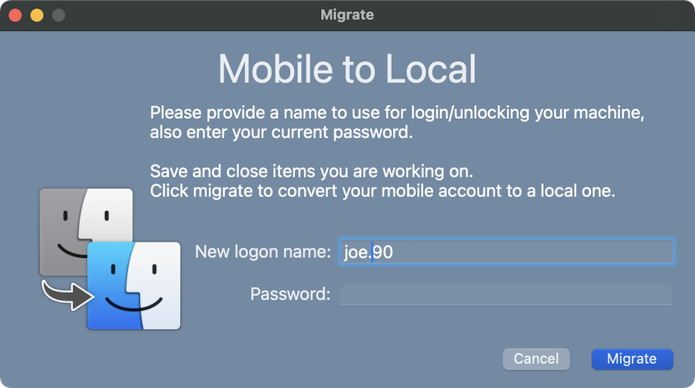

# Mobile to Local

  
    

Migrate mobile Active Directory account to a local account.<br>
Requires 10.15 or later.<br>
Download: [Mobile to Local](https://github.com/BIG-RAT/mobile_to_local/releases/latest/download/Mobile.to.Local.zip)

Wanted to create an easy to use method to migrate mobile accounts to local accounts.  One item in particular I wanted to address was ensuring a FileVault 2 enabled mobile account was migrated to a FileVault 2 enabled local account and have arrived at the following.



The app should be launched with elevated privileges:

```sudo /path/to/Mobile\ to\ Local.app/Contents/MacOS/Mobile\ to\ Local```


A notice will be displayed if the app is not launched with elevated privileges.


The password is verified during the process, if entered incorrectly the user will be alerted.


There is also a check to ensure the account is not already a local one.


If the user is allowed to change their login name an alert will be given if the name is already taken.


Attributes not needed for the local account are removed.  The removal process is accomplished by either using a list of attributes to remove (removeList) or a list of attributes to keep (keepList).  If no list type is provided keepList will be used.</br>
**Important**: Starting with v3.0.0 only the keepList is used.</br>
Currently these are the lists:
| removeList |  | |  | |  | keepList |
|  :---: | :---: | :---: | :---: | :---: | :---: | :---: |
| _writers_LinkedIdentity |  | |  | |  | _writers_AvatarRepresentation |
| account_instance |  | |  | |   | _writers_hint |
| cached_auth_policy |  | |  | |   | _writers_inputSources |
| cached_groups |  | |  | |   | _writers_jpegphoto |
| original_realname |  | |  | |   | _writers_passwd |
| original_shell |  | |  | |   | _writers_picture |
| original_smb_home |  | |  | |   | _writers_unlockOptions |
| preserved_attributes |  | |  | |   | _writers_UserCertificate |
| AppleMetaRecordName |  | |  | |   | accountPolicyData |
| CopyTimestamp |  | |  | |   | AvatarRepresentation |
| EMailAddress |  | |  | |   | inputSources |
| FirstName |  | |  | |   | record_daemon_version |
| JobTitle |  | |  | |   | unlockOptions |
| LastName |  | |  | |   | AltSecurityIdentities |
| MCXFlags |  | |  | |   | AppleMetaNodeLocation |
| MCXSettings |  | |  | |   | AuthenticationAuthority |
| OriginalAuthenticationAuthority |  | |  | |   | GeneratedUID |
| OriginalNodeName |  | |  | |   | JPEGPhoto |
| PasswordPolicyOptions |  | |  | |   | NFSHomeDirectory |
| PhoneNumber |  | |  | |   | Password |
| PrimaryNTDomain |  | |  | |   | Picture |
| SMBGroupRID |  | |  | |   | PrimaryGroupID |
| SMBHome |  | |  | |   | RealName |
| SMBHomeDrive |  | |  | |   | RecordName|
| SMBPasswordLastSet |  | |  | |   | RecordType |
| SMBPrimaryGroupSID |  | |  | |   | UniqueID |
| SMBSID |  | |  | |   | UserShell |
| Street |


* AuthenticationAuthority has LocalCachedUser and Kerberosv5 (for the domain) settings removed

Mobile account shortname is added as an alias to the local account RecordName, if they differ.


The process is relatively quick, under 30 seconds, and logs to /var/log/mobile.to.local.log.  The resulting local account is FileVault 2 enabled (if enabled to begin with) and retains local group membership.

The local account retains the uniqueID of the mobile account, this removes the need to reset permissions.  Group permissions on the user folder as set to staff.  Lastly, the shortname can only contain the following:<pre>numbers
     letters
     - (dash)
     _ (underscore)
     . (period)</pre>

Available switches that can be passed:
<pre>
-allowNewUsername: whether or not to allow the user to change their current shortname.  Value is either true or false.
        -userType: type of account to migrate to.  Value is either standard or admin.
          -unbind: whether or not to unbind after migrating.  Value is either true or false.
            -mode: whether or not to prompt the user for input.  If mode is silent the user will not be prompted for input.
                   Silent mode cannot be used if the user does not have a secure token.
        -message: override default text displayed on initial window.
      -analytics: whether or not to send anonymous usage information to aid in developement. Value is either enabled or disabled.
        -listType: Defines how attributes will be removed.  Use either removeList (only available pre v3.0.0) or keepList.
</pre>

Starting with version 3.2.0 anonymous hardware and OS information will be sent to [TelemetryDeck](https://telemetrydeck.com/) to aid in developement of the app.

#### Examples:
To allow the user to change their login name launch the app with the -allowNewUsername switch:

```sudo /path/to/Mobile\ to\ Local.app/Contents/MacOS/Mobile\ to\ Local -allowNewUsername true```



Note, the user home directory will not be renamed when changing the shortname of the user due to privacy preference restrictions.

To specify the type of local account to create and unbind the machine from Active Directory use the -userType and -unbind switches:

```sudo /path/to/Mobile\ to\ Local.app/Contents/MacOS/Mobile\ to\ Local -userType admin -unbind true```

Display custom text:

```sudo /path/to/Mobile\ to\ Local.app/Contents/MacOS/Mobile\ to\ Local -message "Migrating your mobile account\\nEnter your existing password\\n\\nBe sure to save your work and close any applications before migrating."```


To migrate a mobile account to local and set them as a standard user without prompting for input:

```sudo /path/to/Mobile\ to\ Local.app/Contents/MacOS/Mobile\ to\ Local -mode silent -userType standard```

The switches can be used together (order doesn't matter):

```sudo /path/to/Mobile\ to\ Local.app/Contents/MacOS/Mobile\ to\ Local -allowNewUsername true -userType admin```

<hr>

#### Possible Deployment Setup:
Create a script with the desired options to launch the app (located in /Applications/Utilities).  You'll have to already deployed the app of course.

Create an ongoing policy with no triggers.  Make the policy available in Self Service, scoped appropriately, perhaps to machines that report as bound to Active Directory.
 <hr>
 
Thanks for aiding in the project:
* @dstranathan
* @matthewsphillips
* @ryanslater_uk


